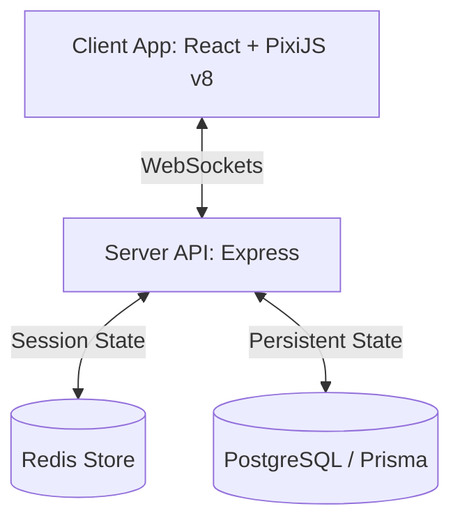

# Technical Product Requirements Document (PRD): Mining Mini-Game

This document details the requirements and technical design for the 2D grid-based Mining Mini-game in **Need vs. Greed**. It is structured to serve as a direct guide for implementation by an LLM or developer.

---

## 1. Game Overview
The mining mini-game replaces the existing static mining actions with an interactive 2D grid-based crawler, inspired by classic games like *Dig Dug* and *Motherload*. 

- **Grid Size:** $30 \times 30$ tiles.
- **Goal:** Navigate the subterranean grid, mine minerals, collect chests, avoid falling rocks, and safely return to the entrance tile to secure the loot.
- **Session Lifespan:** A single active session per character. Sessions are ephemeral and stored in memory/Redis. Refreshing the browser or backing out abandons/wipes the session and forfeits all temporary loot.

---

## 2. Core Mechanics

### 2.1 Tilemap & Generation
Each mining trip generates a new $30 \times 30$ grid based on a server-generated seed.
- **Entrance Tile:** Located on the top row (e.g., at coordinates `(15, 0)`).
- **Tile Types:**
  - **Dirt:** Basic block, easy to mine.
  - **Rocks:** Indestructible (unless blown up by dynamite), subject to gravity.
  - **Minerals (Ores):** Blocks containing resources. Rarity and distribution depend on the player's current city.
  - **Treasure Chests:** Exactly 2 chests generated per map at random deep coordinates. Run over them to open.
  - **Excavated/Empty:** Walkable tiles.
- **Dropped Items:** Items/minerals dropped on the ground (e.g., from dynamite explosions). Walk over them to pick them up.
- **Anti-Cheat Generation:** The generator outputs mineral/chest *placeholder* positions but does NOT reveal their actual contents or loot tables to the client. The actual item/mineral type is rolled server-side only when excavated/opened.

### 2.2 Movement & Pathfinding
- **Controls:** WASD or Arrow keys.
- **Directions:** Up, Down, Left, Right (no diagonal movement).
- **Movement & Action Protocol:** Communicated exclusively via WebSockets. Client can predict movements locally, but the authoritative character position, stamina, and grid state are managed and validated by the server.

### 2.3 Mining & Excavation
- **Trigger:** Moving against an unexcavated block starts the mining process.
- **Mining Time:** Formula-based, scaling with block health (dirt vs. ore type) and player mining speed (mining level/proficiencies + equipment modifiers).
- **Stamina Cost:** Excavating blocks consumes Stamina. The server validates that the character has sufficient Stamina before allowing excavation to begin, deducting stamina persistently from the database/character state on block completion.
- **Stamina Recovery:** Stamina is not recovered inside the mine unless the user uses a stamina potion (or another stamina recovery item) from their backpack.
- **State Transition:**
  1. Client sends `MINING_START` WebSocket event with target coordinates. Server records start timestamp in Redis.
  2. Client animates mining progress bar.
  3. Client sends `MINING_COMPLETE` WebSocket event. Server verifies the elapsed duration matches or exceeds the required mining time, deducts Stamina from Postgres, generates loot, and places it in the temporary backpack.

### 2.4 Gravity (Falling Rocks)
- **Behavior:** Falling rocks are instantly resolved on the server when the block underneath them is removed (mined or blown up).
- **Hazard:** The server determines the final resting place of the rock and checks if it lands on the player's position. If the player is caught underneath, they take massive damage.
- **State Update:** The server updates the grid state and sends the resolved grid and player status to the client in the response payload.

### 2.5 Vision (Fog of War)
- **Default Range:** 1 tile in all cardinally adjacent directions (Up, Down, Left, Right). All other tiles are blacked out (Fog of War).
- **Upgrades:** Vision range can be expanded via item stats or character buffs.

### 2.6 Dynamite & Dropped Items
- **Activation:** Pressing the `E` key places dynamite on the player's current tile (requires dynamite in main backpack, or temporary backpack).
- **Explosion Behavior:** After a brief delay (e.g., 3 seconds), it explodes, clearing all tiles within its blast radius (including Rock tiles).
- **Dropped Items:** When a tile containing a mineral or chest is blown up, the item drops directly onto the map at that coordinate instead of going directly into the backpack. 
- **Icons & Pickups:** The frontend renders the item's icon at the dropped coordinate. The player must walk over the coordinate to add the item to their temporary backpack.

---

## 3. Backpack & Inventory Management
- **Dual Inventories:** 
  - **Main Backpack:** Normal player inventory. Items can be used (e.g., healing/stamina potions, dynamite) but new loot cannot be added directly.
  - **Temporary Backpack (Loot Sack):** Holds all items harvested or picked up during the current session.
- **Extraction:**
  - Leaving through the entrance tile transfers all temporary loot to the Main Backpack.
  - Death or leaving the page/disconnecting wipes the session and empties the temporary backpack.

---

## 4. Technical Architecture

### 4.1 Technology Stack
- **Communication Protocol:** WebSockets only (no HTTP REST requests for active game state).
- **Frontend Engine:** PixiJS (v8) + `@pixi/react` for the 2D grid rendering, item drop icons, particle effects, and animations.
- **Frontend UI:** Tailwind CSS for HUD, inventories, stamina bars, and overlays.
- **Server:** Node.js (v24), Express, Prisma (PostgreSQL).
- **Session Cache:** Redis for real-time validation state (current active map grid, player position, pending mining/dynamite timestamps).



### 4.2 Redis Session Data Structure
An active mining session is cached in Redis under the key `mining:session:${characterId}`:
```json
{
  "seed": 12345,
  "current_position": { "x": 15, "y": 0 },
  "grid": [
    [0, 0, 1, 0, 2],
    [0, 1, 1, 2, 0]
  ],
  "temporary_backpack": [],
  "pending_action": {
    "type": "MINING" | "DYNAMITE",
    "coords": { "x": 15, "y": 1 },
    "start_time": 1718223000000
  }
}
```

---

## 5. Implementation Plan & Milestones

### Milestone 1: Database & Redis Schema
- [ ] Update Prisma schema to support the mining mini-game state (if any persistence is required, e.g., tracking character's current active session identifier).
- [ ] Implement Redis schema and validation helper functions on the server.

### Milestone 2: Map Generator
- [ ] Write seedable grid generator ($30 \times 30$).
- [ ] Implement mineral, rock, and chest spawning parameters tied to city attributes.

### Milestone 3: WebSocket Event Handling (Server-Side)
- [ ] `mining:start`: Initialize a session.
- [ ] `mining:move`: Validate step and calculate falling rock hazards instantly.
- [ ] `mining:mine_start` & `mining:mine_complete`: Validate mining timestamps, deduct stamina, and distribute loot.
- [ ] `mining:dynamite_place` & `mining:dynamite_detonate`: Blow up tiles, drop items, and record coordinates of dropped items.
- [ ] `mining:item_pickup`: Validate character position is on a dropped item tile, update temporary backpack.
- [ ] `mining:exit`: Complete session and transfer inventory.

### Milestone 4: PixiJS v8 Client Rendering
- [ ] Create 2D tilemap renderer.
- [ ] Implement player movement animations, keyboard handler, and Fog of War rendering.
- [ ] Render dropped item icons on empty coordinates.
- [ ] Add falling rock animation and crushing visual effects.
